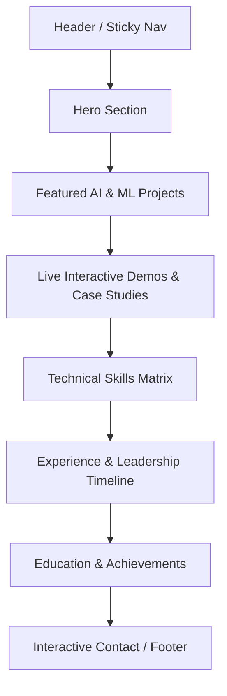
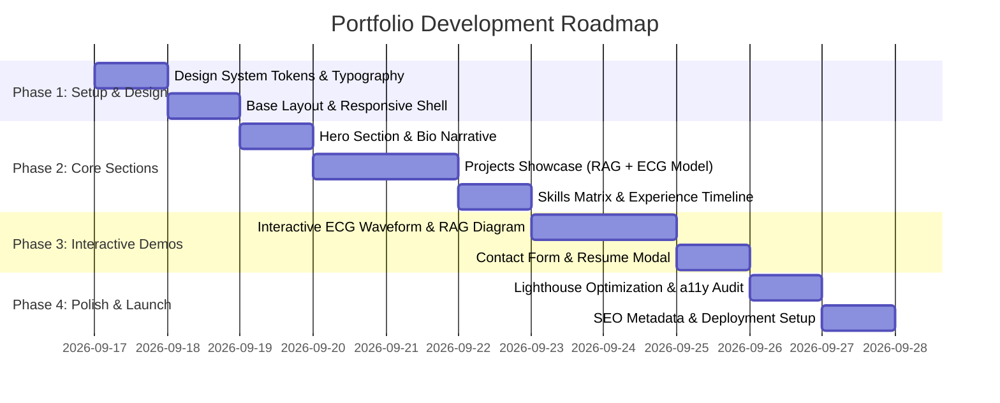

# Product Requirements Document (PRD)
## Personal AI & Data Science Portfolio Website: Adarsh Gaurav

---

## 1. Executive Summary

- **Project Name:** Adarsh Gaurav — Portfolio & AI Engineering Showcase
- **Owner / Profile:** Adarsh Gaurav (CS Undergraduate, Data Science & Machine Learning Practitioner)
- **Target Role:** Data Scientist, Machine Learning Engineer, AI Application Developer
- **Objective:** Build a high-performance, visually captivating, interactive personal portfolio website that translates technical resumes and project achievements into an engaging digital experience. The platform highlights hands-on expertise in end-to-end ML pipelines, deep learning architectures (multimodal fusion, RAG systems), predictive analytics, and full-stack deployment.

---

## 2. Target Audience & User Personas

| Persona | Primary Needs & Goals | Key Portfolio Touchpoints |
| :--- | :--- | :--- |
| **Technical Recruiter** | Quick scan of qualifications, core skills (Python, PyTorch, SQL), contact info, resume download, education, and graduation year (May 2026). | Clean Hero section, 1-Click Resume Download, concise Skills matrix, direct contact & LinkedIn links. |
| **Hiring Manager / ML Lead** | Evidence of technical depth, engineering rigor, algorithmic understanding, architecture decisions, and real-world deployment viability. | In-depth Project Case Studies (RAG, Multimodal CNN-BiLSTM-Transformer), metrics (96%+ acc, 0.995 ROC-AUC), architecture diagrams. |
| **Fellow Engineers & Collaborators** | Clean code quality, GitHub activity, open-source repositories, shared interests in LLMs and predictive systems. | GitHub repository cards, live interactive demos, tech stack tags, clean UI implementation. |

---

## 3. Brand Identity & Design System

### 3.1 Visual Aesthetics
- **Theme:** Modern Cyber-Analytical Dark Theme (Default) with sleek glassmorphism and subtle neon accents.
- **Color Palette:**
  - **Background Base:** Deep Obsidian / Slate (`#0B0F17`, `#111827`)
  - **Surface & Cards:** Frosted Glass / Translucent Navy (`rgba(17, 24, 39, 0.75)` with `backdrop-filter: blur(12px)`)
  - **Primary Accent (Intelligence):** Electric Cyan (`#06B6D4` / `#22D3EE`)
  - **Secondary Accent (Data & AI):** Neon Violet / Indigo (`#8B5CF6` / `#6366F1`)
  - **Success / High Performance:** Emerald Green (`#10B981`)
  - **Typography:** Modern geometric sans-serif (e.g., `Inter`, `Outfit`, or `Space Grotesk`) paired with a monospace font (`JetBrains Mono` or `Fira Code`) for metrics, architecture specs, and terminal widgets.

### 3.2 Dynamic & Interactive Elements
- **Hero Canvas / Background:** Subtle animated particle constellation or neural graph nodes connecting dynamically on mouse hover.
- **Interactive ECG Signal Simulation:** An animated SVG/Canvas waveform in the Multimodal Heart Disease project card demonstrating real-time biomedical signal processing.
- **RAG Architecture Flowchart:** Step-by-step interactive diagram showing lecture audio processing $\rightarrow$ Whisper transcription $\rightarrow$ BGE-M3 dense retrieval $\rightarrow$ Ollama Llama 3.2 synthesis.
- **Micro-Interactions:** Smooth magnetic buttons, soft glow on card hover, fluid scroll animations, and interactive skill badge filtering.

---

## 4. Information Architecture & Page Structure

### Section-by-Section Specifications

### 4.1 Header & Navigation
- **Branding:** Minimalist logo monogram (`AG` or `<Adarsh />`).
- **Nav Links:** `About`, `Projects`, `Skills`, `Experience`, `Contact`.
- **Action Buttons:** 
  - `Resume` (Direct PDF Download with icon and preview modal).
  - Quick-links: GitHub (`github.com/adarshgaurav1951`), LinkedIn (`linkedin.com/in/adarsh-gaurav`), Email (`adarshgaurav1624@gmail.com`).

### 4.2 Hero Section
- **Headline:** 
  - *"Engineering Intelligence from Data to Deployment."*
  - Dynamic typewriter subtitle: `Machine Learning Engineer` | `RAG & LLM Specialist` | `Full-Stack Data Practitioner`.
- **Value Proposition:** 
  > Computer Science undergraduate specializing in predictive modeling, multimodal deep learning, and scalable RAG pipelines. Bridging data science rigor with production software engineering.
- **Key CTAs:**
  - `Explore Projects` (Smooth scroll to Projects).
  - `Get in Touch` (Opens modal or scrolls to Contact).
  - `Download Resume` (Tracks download event).
- **Quick Stats Bar:**
  - `96%+` Heart Disease Classification Accuracy | `0.995` ROC-AUC
  - `BGE-M3 + Llama 3.2` Local RAG Engine
  - `B.Tech CSE '26` Guru Ghasidas Vishwavidyalaya

### 4.3 Featured Projects (Deep Dive Case Studies)

#### Project 1: Multimodal Deep Learning Framework for Heart Disease Prediction
- **Tags:** `PyTorch` `CNN-BiLSTM-Transformer` `ECG Processing` `FastAPI` `React.js` `PostgreSQL`
- **Problem Statement:** Early cardiac condition detection suffers from disjointed diagnostic tools that analyze clinical tabular stats separately from continuous electrophysiological signals.
- **Architectural Solution:**
  - Signal processing pipeline for raw ECG waveform features.
  - Classical preprocessing for patient demographic and blood panel metrics.
  - Hybrid fusion layer unifying temporal sequence models (BiLSTM + Transformer self-attention) with CNN spatial representations.
- **Impact & Metrics:**
  - **96%+ Accuracy** and **0.995 ROC-AUC** across cross-validated benchmarks.
  - Containerized FastAPI microservice delivering sub-150ms inference.
- **Interactive Feature:** Live ECG waveform animator + interactive risk factor simulator slider.

#### Project 2: RAG-based AI Teaching Assistant
- **Tags:** `Python` `OpenAI Whisper` `BGE-M3` `Llama 3.2` `Ollama` `scikit-learn` `FFmpeg`
- **Problem Statement:** Students struggle to locate granular technical explanations across dozens of hours of recorded university lectures.
- **Architectural Solution:**
  - Automated audio extraction and transcription with Whisper large-v2 and FFmpeg chunking.
  - Dense embedding pipeline using BGE-M3 vectorization and cosine similarity retrieval.
  - Local LLM inference integration (Llama 3.2 via Ollama) with anti-hallucination prompt constraints and citation grounding.
- **Interactive Feature:** Interactive query simulator previewing how time-stamped citations link to video segments.

### 4.4 Technical Skills Matrix
Organized with interactive category filter tabs:
- **Languages:** Python (Advanced), SQL (PostgreSQL), Java, C/C++, JavaScript, HTML5/CSS3.
- **Machine Learning & Deep Learning:** PyTorch, Scikit-learn, CNNs, BiLSTM, Transformers, Predictive Modeling, SVM, Feature Engineering.
- **Generative AI & LLMs:** RAG Architectures, Vector Embeddings (BGE-M3), OpenAI Whisper, Ollama, Prompt Engineering, Semantic Search.
- **Data Engineering & Visualization:** Pandas, NumPy, Matplotlib, Seaborn, Clinical & Time-Series Data Preprocessing.
- **Web & Backend:** FastAPI, React.js, RESTful APIs, Tailwind CSS.
- **Tools & Platforms:** Git/GitHub, Google Cloud Platform (GCP), Docker basics, VS Code, Google Colab, Linux environment.

### 4.5 Experience & Leadership Timeline
1. **Data Science Intern — CodSoft** *(June 2025 – July 2025 | Remote)*
   - Analyzed real-time datasets to discover patterns directly driving product analytics.
   - Built and benchmarked predictive models in Python, Pandas, and NumPy.
   - Designed executive data visualizations to present complex ML insights to non-technical stakeholders.
2. **Web Development Intern — CodeAlpha** *(Oct 2024 – Nov 2024 | Remote)*
   - Engineered responsive front-end interfaces utilizing HTML, Tailwind CSS, and JavaScript.
   - Implemented real-time form validation and error handling to reduce user friction.
3. **Student Leader — Pregrad**
   - Coordinated campus technology initiatives and led cross-functional student teams through innovation sprints.
4. **Deloitte Data Analytics Simulation**
   - Completed comprehensive simulation delivering data-driven business recommendations and analytical dashboards.

### 4.6 Education & Credentials
- **Bachelor of Technology in Computer Science & Engineering**
  - *Guru Ghasidas Vishwavidyalaya (A Central University), Bilaspur (C.G.)*
  - Duration: Dec 2022 – May 2026 | CGPA: 7.1 / 10
- **High School Education:**
  - Central Public School (CBSE Class XII) — 70%
  - D.A.V. Public School (CBSE Class X) — 80.88%

### 4.7 Contact & Footer
- Direct message form: Name, Email, Subject, Message with instant validation.
- Direct contact details:
  - Phone: `+91 7033375667`
  - Email: `adarshgaurav1624@gmail.com`
  - Location: India
- Social links: GitHub, LinkedIn, Kaggle/Twitter (if applicable).
- Copyright, dynamic year, and *"Designed & Developed by Adarsh Gaurav"*.

---

## 5. Functional Requirements (FR)

- **FR-1 [Responsive Navigation]:** Sticky, translucent navigation bar with smooth scroll anchors to all sections, mobile hamburger menu, and active section highlighting based on scroll spy.
- **FR-2 [Resume Integration]:** Prominent resume action that allows both direct download of `My Resume_DS.pdf` and a quick-view modal.
- **FR-3 [Filterable Project/Skill Cards]:** Instant client-side filtering of skills and projects based on tags (`All`, `Machine Learning`, `GenAI / RAG`, `Full-Stack`).
- **FR-4 [Interactive Project Drawers / Modals]:** Clicking a project expands an in-depth breakdown with architecture diagrams, data flow steps, and links to GitHub repositories.
- **FR-5 [Contact Form & Notifications]:** Functional contact form with client-side regex validation, spam prevention (honeypot field), and integration with EmailJS / Formspree or custom API route.
- **FR-6 [Interactive Code / Terminal Easter Egg]:** A mini CLI terminal drawer allowing users to type commands like `help`, `skills`, `projects`, `contact`, `clear` to showcase engineering flair.

---

## 6. Non-Functional Requirements (NFR)

- **Performance & Speed:**
  - Google Lighthouse performance score $\ge$ 95.
  - First Contentful Paint (FCP) $\le$ 1.0s.
  - Optimized image assets (WebP/SVG), lazy-loaded project previews.
- **Responsiveness & Cross-Browser Support:**
  - Pixel-perfect layout across mobile (360px+), tablet (768px+), desktop (1024px+), and ultra-wide screens.
  - Full compatibility with Chrome, Edge, Safari, Firefox.
- **Accessibility (a11y):**
  - WCAG 2.1 Level AA compliance.
  - High contrast text ratios ($\ge 4.5:1$ for normal text).
  - Proper ARIA landmarks, roles, keyboard focus outlines, and screen-reader descriptive labels.
- **SEO & Social Sharing:**
  - Metadata tags (OpenGraph, Twitter Cards) configured for rich link previews on LinkedIn and Twitter.
  - Semantic HTML5 structure (`<header>`, `<main>`, `<section>`, `<article>`, `<footer>`).
  - Structured JSON-LD schema (`ProfilePage` and `Person`).

---

## 7. Recommended Technology Stack

| Layer | Recommended Choice | Rationale |
| :--- | :--- | :--- |
| **Framework** | **HTML5 + Modern CSS + JavaScript** (or **React + Vite**) | Blazing fast load times, zero bloat, high FPS animations, easy to deploy on any static host. |
| **Styling** | **Custom Modern CSS (Variables + Glassmorphism)** | Complete control over custom futuristic/analytical aesthetics, fluid transitions, and responsive grid/flexbox. |
| **Icons** | **Lucide Icons / FontAwesome SVG** | Crisp, scalable, lightweight icon set for tech stacks and contact elements. |
| **Animations** | **CSS Keyframes + Canvas API / IntersectionObserver** | Native browser performance without heavyweight external dependencies. |
| **Hosting & CI/CD** | **GitHub Pages / Vercel / Netlify** | Free tier, instantaneous automatic deployments directly from the GitHub repository. |

---

## 8. Implementation Roadmap & Milestones

---

## 9. Success Metrics & Verification Criteria

1. **Recruiter Conversion:** Clear paths to view projects, GitHub code, and download resume within 5 seconds of landing.
2. **Visual Impact:** Clean, sleek dark-mode interface with zero visual layout shifts (CLS < 0.05).
3. **Zero Dead Links:** All external links (GitHub profile, LinkedIn, project repos, email mailto) verified and functional.
4. **Flawless Mobile Experience:** 100% of interactive elements touch-friendly with minimum 44px tap targets.